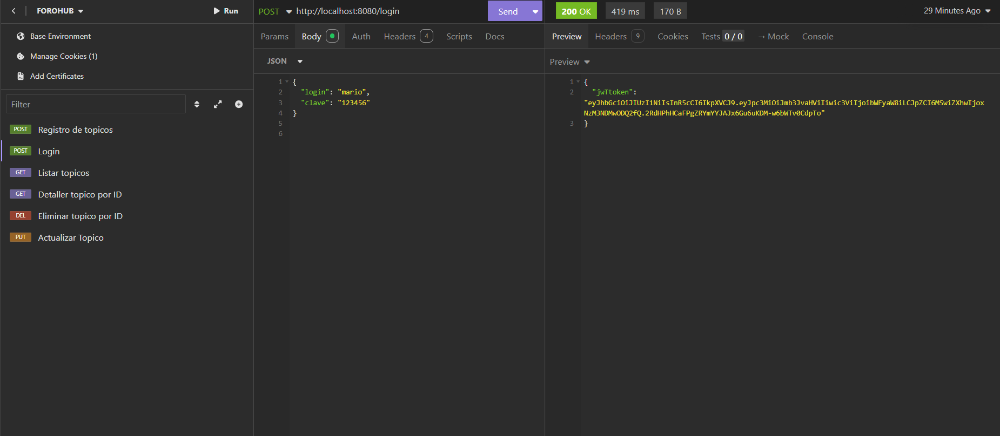
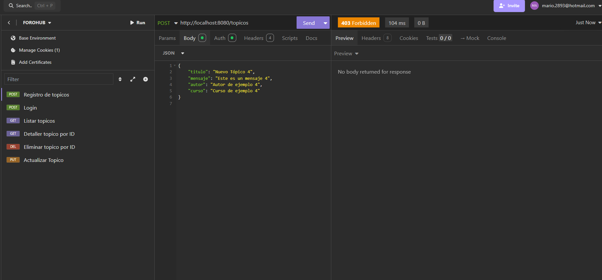
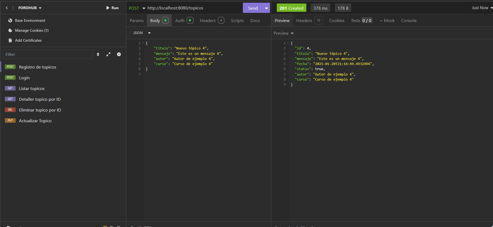
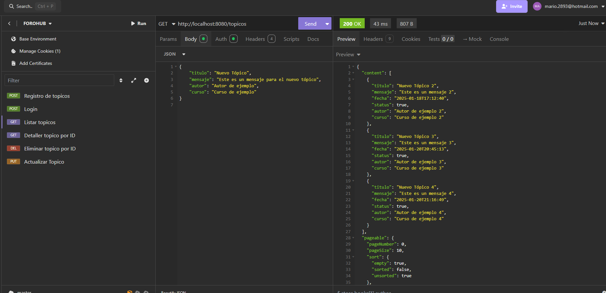
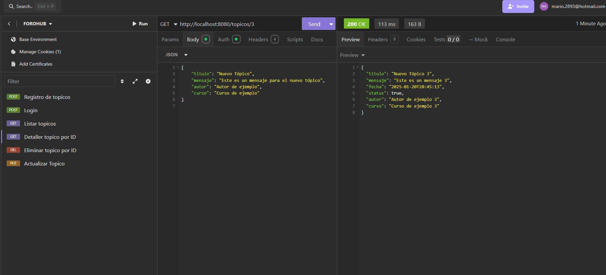
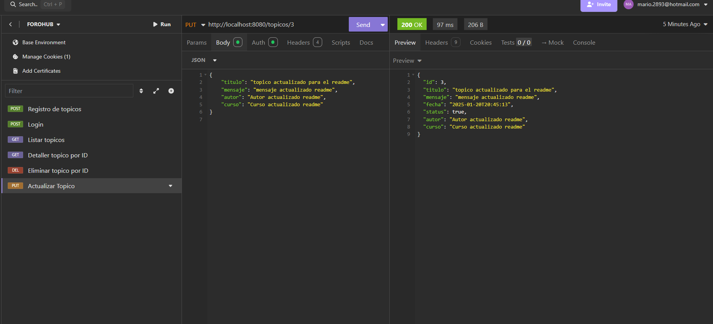
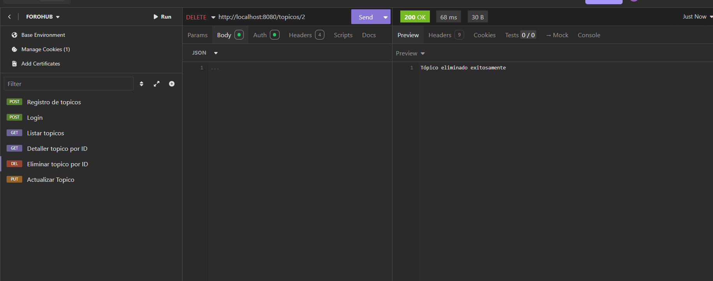

# Challenge FOROHUB 💻

Forohub es un desafio que forma parte del programa d educacion en tecnologia de ORACLE ONE + ALURA LATAM, el cual se centra en la creacion de un foro para una API, en donde el usuario podra escribir dudas sobre algun curso en especifico, espero sea de su agrado vamos..!

## Comencemos 🚀

_Estas instrucciones te permitirán obtener una copia del proyecto en funcionamiento en tu máquina local para propósitos de desarrollo y pruebas._

### Pre-Requisitos 📋

_Para ejecutar este proyecto, necesitarás tener instalado lo siguiente:_

- JDK 17 o superior
- Maven (para gestionar las dependencias)
- Spring: versión actual
- Mysql: versión actual
- IDE (Entorno de desenvolvimento integrado) - IntelliJ IDEA

Para el **Despliegue** se detalla los siguientes pasos.
#### Instalación en Windows

1. **Instalar Java**
    - Descarga e instala el JDK desde el sitio oficial de Oracle:  
      [Descargar JDK](https://www.oracle.com/java/technologies/javase-jdk21-downloads.html)
    - Sigue las instrucciones del instalador para instalar el JDK.
    - Verifica la instalación abriendo la consola `cmd` y ejecutando:
      ```
      java -version
      ```

2. **Instalar Maven**
    - Descarga Maven desde el sitio oficial:  
      [Descargar Maven](https://maven.apache.org/download.cgi)
    - Descomprime el archivo descargado y agrega la ruta de Maven a las variables de entorno de tu sistema.
    - Verifica la instalación abriendo la consola `cmd` y ejecutando:
      ```
      mvn -version
      ```

### Instalación del programa🔧

_Una serie de pasos para tener el entorno de desarrollo configurado:_

1. **Clonar el repositorio**  
   Clona este repositorio en tu máquina local usando Git:
   ```
   git clone https://github.com/ariocal/ForoHub.git
   cd literalura
   ```

2. **Agregar dependencias**  
   Este proyecto utilizaron depdencias como security, auth y flyway entre otras que se detallan al final. Si estás usando Maven, puedes agregar las dependencias al archivo `pom.xml` de la siguiente manera:

   ```xml
	<dependency>
			<groupId>org.flywaydb</groupId>
			<artifactId>flyway-core</artifactId>
		</dependency>
		<dependency>
			<groupId>org.flywaydb</groupId>
			<artifactId>flyway-mysql</artifactId>
		</dependency>
		<dependency>
			<groupId>com.auth0</groupId>
			<artifactId>java-jwt</artifactId>
			<version>4.4.0</version>
		</dependency>
   <dependency>
    <groupId>org.springframework.boot</groupId>
    <artifactId>spring-boot-starter-security</artifactId>
</dependency>
   ```

3. **Compilar el proyecto**  
   Compila el proyecto con Maven:
   ```
   mvn clean install
   ```

_Finaliza estos pasos con la creación del archivo JAR ejecutable:_

4. **Crear el archivo JAR**  
   Ejecuta el siguiente comando para empaquetar el proyecto en un archivo JAR:
   ```
   mvn package
   ```

5. **Ejecutar el programa**  
   Para ejecutar el archivo JAR generado, utiliza:
   ```
   java -jar target/forohub.jar
   ```

### Guia de funcionamiento ⌨️
-Para poder probar el programa es necesario usar insomnia que permitira ejecutar las peticiones http, lo principal para tener acceso es hacer el login y generar el token. Para ello ingresamos el login que seria el usurio y la clave que es nuestra contraseña...
###### aRealizar login y generacion del token.


Cuando ya tengamos el token podemos usarlo para tener los permisos necesarios, si nosotros no generamos y posterior no usamos el token nos va dar error de autenticacion. Como podemos notar en la imagen tenemos un error 403
###### La autenticacion3.
 
 
Para evitar eso ingresamos el token en el apartado del Auth y procedemos a relizar un registro de un topico. Y podemos notar en la imagen un codigo 201 indicando que el topico fue creado. No olvidemos que es importante el uso del endpoint y en este caso es una peticion de tipo POST
###### Registro de un topico


Lo que queremos el listar todos los topicos podemos hacer una peticion GET y especificamos el point o la ruta especifica.
###### Listar autores registrados.


Si queremos buscar un topico en espeficio es igual una peticion de tipo GET pero en la ruta es necesario especificar el ID del topico que deseamos buscar
###### Listar autores vivos en un determinado año.



Para actualizar un topico debemos hacer una peticion de tipo PUT en el endpoint detaller el id del topico que queremos actualizar. Justo como se muestra en la imagen
###### Listar libros por idiomas.


Para fianlizar podemos elimar un topico haciendo una peticion de tipo delete. Como notan en el cuerpo no se envia nada pero en el endpoint se especifica el ID y tenemos un codigo 200.
###### Salir del programa.


## Construido con 🛠️

_Herramientas utilizadas en el desarrollo del proyecto:_

Dependencias para agregar al crear el proyecto con Spring Initializr:
Lombok
Spring Web
Spring Boot DevTools
Spring Data JPA
Flyway Migration
MySQL Driver
Validation
Spring Security

Para la seguridad se utilizo:
 Auth0
 JWT

Para realizar pruebas:
Insomnia

## Autor ✒️


* **Mario Calderon** - *Creador* - 👨🏽‍💻🖥️
